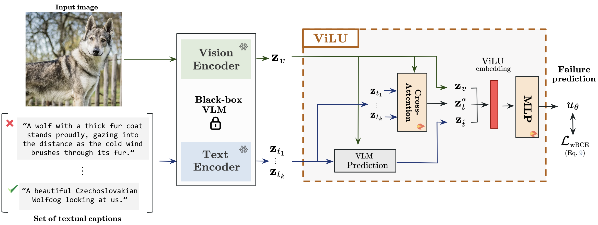

# LuMen
This is the official Pytorch implementation of our ICCV2025 submission *10053*. 

**The code is available for review only, do not share.**




## Installation
```
conda create -n lumen python=3.11
conda activate lumen
conda install pytorch torchvision torchaudio pytorch-cuda=12.1 -c pytorch -c nvidia
pip install -e .
```
## Datasets 

```
data/
|––––Imagenet/
|––––––––ILSVRC2012_devkit_t12.tar.gz
|––––––––train/
|––––––––val/
|––––CIFAR-10/
|––––––––cifar-10-batches-py/
|––––CIFAR-100/
|––––––––cifar-100-python/
|––––caltech101/
|––––––––101_ObjectCategories/
|––––EuroSAT_RGB/
|––––dtddataset/
|––––––––dtd/
|––––––––––––images/
|––––fgvc-aircraft-2013b/
|––––flowers102/
|––––food-101/
|––––––––images/
|––––oxford-iiit-pet/
|––––––––images/
|––––stanford_cars/
|––––SUN397/
|––––UCF-101-midframes/
|––––CC3M/
|––––––––train/
|––––––––val/
|––––CC12M/
|––––––––train/
|––––––––val/
|––––LAION/
|––––––––train/
|––––––––val/
```

## Training 
We provide training scripts in the `scripts` folder. For instance, to launch the training of LuMen on CIFAR-10 with the ViT-B/32 backbone with 400 epochs do:
```
sh scripts/train_lumen_cifar10.sh
```
Note that you may adapt the values of `CUDA_VISIBLE_DEVICES`. Training on an RTX A6000 GPU takes around 2 hours.
The main code for viewing the training loops is located in `lumen/engine/trainer.py`

## Notebook for reproductibility and visualisations
In the `notebooks` folder you can find the scripts for loading and evaluating the pre-trained LuMen models on each dataset, as well as the code for visualising the failure curves. 


