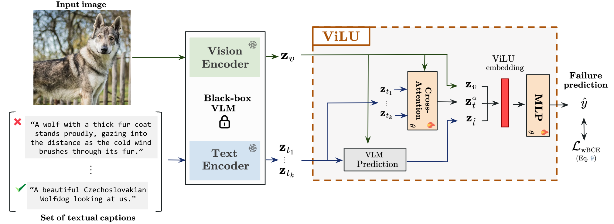

# LuMen
This is the official Pytorch implementation of our ICCV2025 submission ID:10053. The code is available for review only, do not share.




```
conda create -n lumen python=3.11
conda install pytorch torchvision torchaudio pytorch-cuda=12.1 -c pytorch -c nvidia
```
